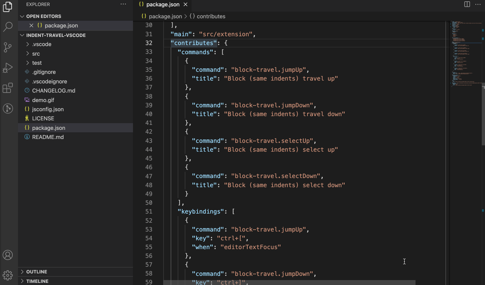

# VScode Indent Travel

Move cursor up or down and select text in between in a document by block (same indents with respect to current cursor's position)

Code repo is based on [vscode_block_travel](https://github.com/sashaweiss/vscode_block_travel).

## Features

The following commands and corresponding default keybindings are provided:

```
block-travel.jumpUp: ctrl+[
block-travel.selectUp: ctrl+shift+[
block-travel.jumpDown: ctrl+]
block-travel.selectDown: ctrl+shift+]
```



## Release Notes

See the [CHANGELOG](./CHANGELOG.md)
